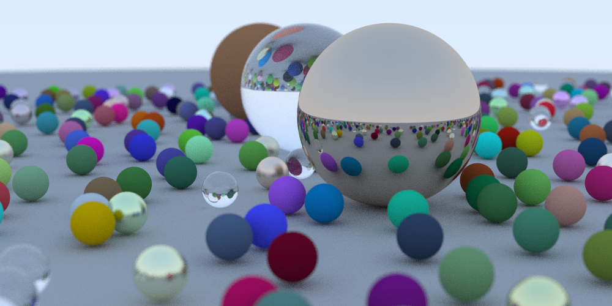
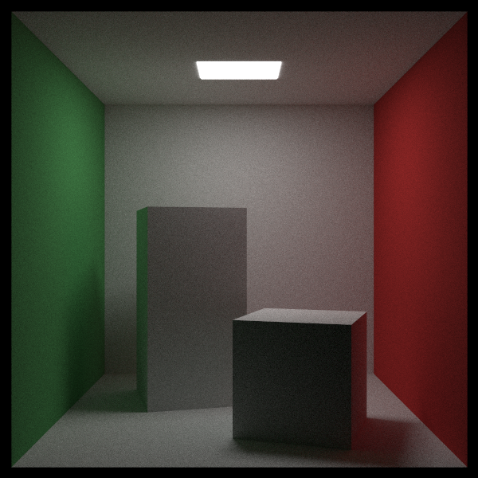
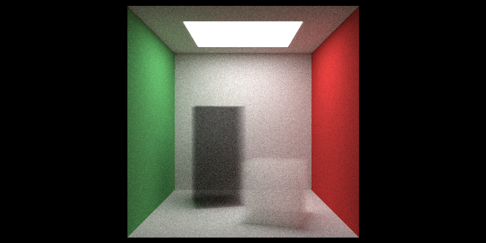
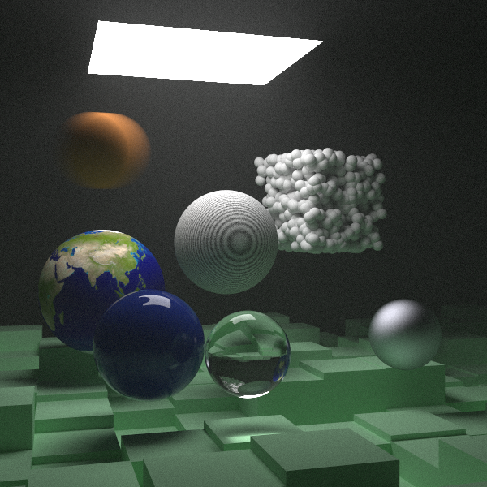

# RayTracer

## Introduction

- My personal practice in ray tracer
- Add some new features: multithreading, thread-safe std::ostream class, cmake build, etc
- Reference: [RayTracing](https://github.com/RayTracing/raytracing.github.io)

## Requirements

- Any compiler supporting C++ 17 standard, like [Visual Studio 2022](https://visualstudio.com)
- [CMake](https://cmake.org/)

## Preview 








## Usage
### OneWeekendApplication
```shell
cmake -D CMAKE_BUILD_TYPE=Release --build build 
cmake -B build
cd bin
# single-threading render
./OneWeekendApplication.exe > image.ppm 
# multithreading render by input number of threads as you wish
./OneWeekendApplication.exe number > image.ppm
```
### OneWeekApplication
```shell
cmake -D CMAKE_BUILD_TYPE=Release --build build 
cmake -B build
cd bin
# single-threading render
./OneWeekApplication.exe > image.ppm 
# multithreading render by input number of threads as you wish
./OneWeekApplication.exe number > image.ppm
```